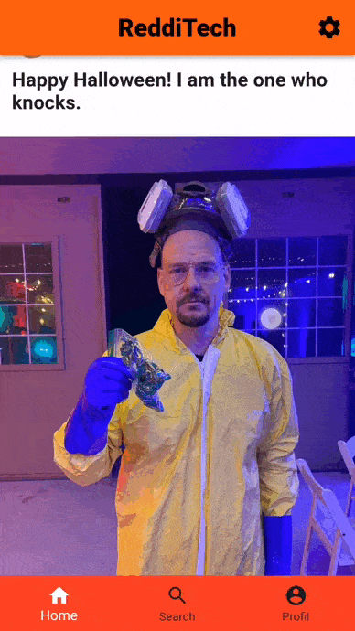
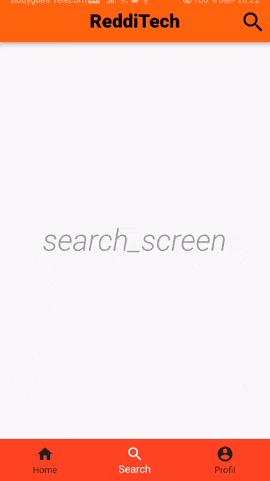

# B-DEV-501-PAR-5-1-redditech-arthur.fouquet

# Presentation

The goal of this project is to recreate the phone application "Reddit".

 We decided to use the flutter framework.

# Installation

  

  

<h1>Previews</h1>

    
SplashScreen

    

    
Home

    

    
Profil

    

    
Search

    

 

# Run

You can create a emulator for launch the debug mode with Android Studio:

  

You can also use your android in order to program on your mobile.
Run this command:

    -   flutter run
  
For create the APK of the application, run this command:

    -   flutter build apk

## Contributors

- Arthur Fouquet [![github-link][github-logo]](https://github.com/arthur-fouquet)
- Charlie Chou [![github-link][github-logo]](https://github.com/Chch270)

[Github-logo]: https://img.shields.io/badge/GitHub-100000?style=for-the-badge&logo=github&logoColor=white